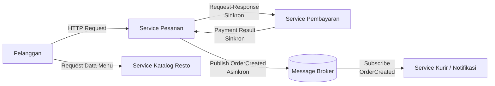

# Jurnal Proses — Tugas 2

## [29 September 2026]
- Opsi arsitektur yang dipertimbangkan: 
  - SOA -> service inti: Pesanan, Pembayaran, Katalog Resto.
  - Pub-Sub -> notifikasi & event turunan: notifikasi resto, penugasan kurir, push ke pelanggan.
  - Api Gateway -> pintu masuk pelanggan.
  - Message Broker -> penghubung event.
- Kenapa akhirnya pilih [SOA/Pub-Sub]: Karena,
  1. SOA saja tidak cukup. Kalau semua komunikasi sinkron, Service Pesanan harus nunggu Service Kurir dan Service Resto. Kalau salah satu lambat/down, Pesanan ikut stuck - masalah pada Tugas 1 terulang.
  2. Pub-Sub juga tidak cocok untuk semua. Proses Pembayaran dan cek menu membutuhkan respons langsung (sukses/gagal, harga valid/tidak). Kalau dipaksa event, pelanggan tidak dapat respons real-time.
  3. Kombinasi:
    - Request yang butuh respons segera -> sinkron lewat SOA.
    - Proses turunan yang tidak perlu bloking -> asinkron lewat Pub-Sub.
    - Service Pesanan cukup publish OrderPaid, tidak peduli siapa yg subscribe.
- Revisi diagram (versi 1 → versi 2, apa yang berubah dan kenapa): Pada rancangan ini ada 4 service utama, yaitu Service Pesanan, Pembayaran, Katalog Resto, dan Kurir/Notifikasi. Message Broker digunakan sebagai perantara untuk komunikasi berbasis event. Komunikasi antara Pesanan dan Pembayaran dilakukan secara sinkron, sedangkan event OrderCreated dikirim secara asinkron melalui Message Broker.

## Log Penggunaan AI (Level 2)

> Wajib diisi sesuai kebijakan Level 2 di [`../RUBRIK-UMUM.md`](../RUBRIK-UMUM.md). Tulis "Tidak memakai AI" pada baris pertama jika memang tidak dipakai. Hanya untuk brainstorming ide/outline — bukan untuk kode/analisis/teks akhir.

| Tanggal | Tool AI | Prompt yang diberikan | Ringkasan saran/ide AI | Bagaimana diolah jadi tulisan/kode sendiri |
|---|---|---|---|---|
| 29 September 2026 | Gemini | Apa yang dimaksud dengan jenis komunikasi sinkron dan asinkron (request response) | Menjelaskan apa itu sinkron dan asinkron | Saya tinggal membedakan saja |

## Jawaban

## 3. Alur Skenario
Nomor 1 Checkout
- Aktor & Komponen: Aplikasi User -> API Gateway -> Order
- Jenis Komunikasi: Sinkron
- Eksekusi: User tekan tombol Checkout. Order memvalidasi stok/harga, menyimpan data ke databasenya sendiri dengan status PENDING_PAYMENT, lalu langsung memberikan respons + Order ID ke aplikasi user.
- Penanganan Masalah: Dipasang strict timeout (misal max 2 detik). Jika Order Service lambat, request diputus daripada menggantung.

Nomor 2 Pembayaran
- Aktor & Komponen: Aplikasi User -> API Gateway → Payment -> Payment Gateway (Bank/E-Wallet)
- Jenis Komunikasi: Sinkron
- Eksekusi: User mengonfirmasi pembayaran dari aplikasi. Payment meneruskan request ini ke API pihak ketiga (Bank/E-Wallet).
- Penanganan Masalah: Dipasang pola Circuit Breaker dan timeout. Jika API bank lemot, Payment langsung melempar respons error ke user tanpa membuat server habis karena menunggu koneksi gantung.

Nomor 3 Konfirmasi Pembayaran
- Aktor & Komponen: Payment -> Message Broker
- Jenis Komunikasi: Asinkron
- Eksekusi: Begitu Bank mengonfirmasi bayar sukses, Payment tidak pernah memanggil API Order secara langsung. Payment hanya melempar satu event ke Message Broker: OrderPaidEvent yang berisi order_id, user_id, dan timestamp. Tugas Payment selesai di sini.

Nomor 4 Notifikasi
- Aktor & Komponen: Message Broker -> Order & Restaurant -> Tablet Resto
- Jenis Komunikasi: Asinkron
- Eksekusi: Order yang mendengarkan event OrderPaidEvent langsung memperbarui status pesanan di database-nya menjadi PAID. Disaat bersamaan, Restaurant mengambil data pesanan, lalu mengontak tablet restoran secara langsung.

Nomor 5 Restoran siapkan makanan
- Aktor & Komponen: Tablet Resto -> Restaurant -> Message Broker
- Jenis Komunikasi: Sinkron lalu asinkron 
- Eksekusi: Koki menekan tombol Terima & Siapkan Pesanan. Tablet mengirim HTTP POST ke Restaurant. Setelah status update di internal resto, Restaurant menerbitkan event FoodIsPreparingEvent ke Message Broker.

Nomor 6 Penugasab kurir
- Aktor & Komponen: Message Broker -> Delivery -> Aplikasi Kurir
- Jenis Komunikasi: Asinkron
- Eksekusi: Delivery menangkap event FoodIsPreparingEvent dari broker. Tanpa perlu tahu apa yang terjadi di Order atau Payment, Delivery langsung menjalankan algoritmanya untuk mencocokkan lokasi resto dengan kurir terdekat. Begitu ada kurir yang menerima, Delivery melempar event CourierAssignedEvent.

## 4. Analisis tertulis: kenapa gaya ini mengatasi masalah coupling dari Tugas 1, dan apa trade-off-nya (mis. Pub-Sub menambah kompleksitas debugging karena alur tidak linear).

Masalah coupling dari Tugas 1
- Deployment Independen: Tim kurir atau resto bisa memperbarui service mereka tanpa perlu menghentikan (restart) Service Pesanan atau Pembayaran. Risk downtime total dapat dihindari.

- Isolasi Kegagalan: Jika Service Notifikasi Kurir mengalami gangguan, proses pembayaran dan pembuatan pesanan di sisi pelanggan tetap berjalan lancar tanpa terhenti.

- Eliminasi Resource Exhaustion: Keterlambatan di pemrosesan notifikasi tidak lagi menyedot thread pool milik Service Pesanan karena prosesnya dipisah oleh Message Broker.

Trade-off
- Kompleksitas Debugging & Tracing: Alur sistem tidak lagi linier. Menelusuri masalah saat terjadi kegagalan pengiriman pesan butuh alat tambahan seperti Distributed Tracing (misalnya Jaeger/Zipkin).

- Eventually Consistent: Informasi penugasan kurir dan penerimaan pesanan resto tidak terjadi secara instan di detik yang sama persis (lag beberapa milidetik pada queue), sehingga konsistensi data bersifat eventual.

- Overhead Operasional: Tim engineering FoodGo kini harus mengelola dan memantau komponen baru seperti API Gateway dan infrastruktur Message Broker.

  